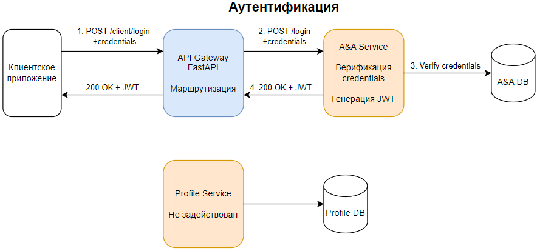
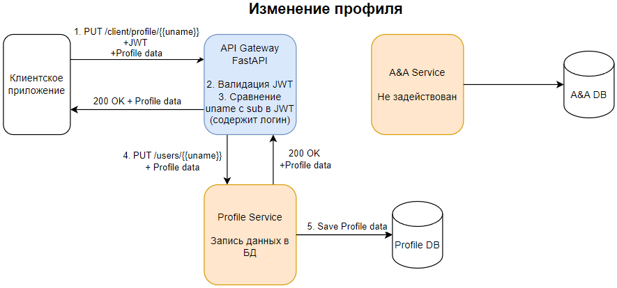

# Домашнее задание №6
## Backend for frontends. Apigateway

### Вариант 1 (С КОДОМ)

#### Добавить в приложение аутентификацию и регистрацию пользователей.

#### Реализовать сценарий "Изменение и просмотр данных в профиле клиента".

##### Пользователь регистрируется. Заходит под собой и по определенному урлу получает данные о своем профиле. Может поменять данные в профиле. Данные профиля для чтения и редактирования не должны быть доступны другим клиентам (аутентифицированным или нет).


#### На выходе должны быть

0) описание архитектурного решения и схема взаимодействия сервисов (в виде картинки)

1) команда установки приложения (из helm-а или из манифестов). Обязательно указать в каком namespace нужно устанавливать.

команда установки api-gateway, если он отличен от nginx-ingress.
тесты постмана, которые прогоняют сценарий:
регистрация пользователя 1
проверка, что изменение и получение профиля пользователя недоступно без логина
вход пользователя 1
изменение профиля пользователя 1
проверка, что профиль поменялся
выход* (если есть)
регистрация пользователя 2
вход пользователя 2
проверка, что пользователь2 не имеет доступа на чтение и редактирование профиля пользователя1.

В тестах обязательно

наличие {{baseUrl}} для урла
использование домена arch.homework в качестве initial значения {{baseUrl}}
использование сгенерированных случайно данных в сценарии
отображение данных запроса и данных ответа при запуске из командной строки с помощью newman.

### ПОДГОТОВКА
#### в /etc/hosts прописываем
```
127.0.0.1 arch.homework 
```

#### Запускаем docker
У меня docker desktop с виртуализацией VT-d

#### Запускаем minikube
```
minikube start --driver=docker
```

#### NGINX ingress controller (если его нет в кластере)
##### Создать namespace под ingress controller
```
kubectl create namespace nginx
```
##### Установка чарта NGINX
```
helm repo add ingress-nginx https://kubernetes.github.io/ingress-nginx/
```
```
helm repo update
```
```
helm install nginx ingress-nginx/ingress-nginx --namespace nginx -f ./nginx/nginx_values.yaml
```

#### Генерируем закрытый и открытый ключи у себя на машине (лучше заранее создать в директории проекта папку ./etc/keys)
```
openssl genrsa -out ./etc/keys/jwt-private.pem 2048
```
```
openssl rsa -in ./etc/keys/jwt-private.pem -pubout -out ./etc/keys/jwt-public.pem
```

#### Создаем в кластере namespace под каждый сервис
##### Для сервиса аутентификации
```
kubectl create namespace auth
```
##### Для API Gateway 
```
kubectl create namespace client
```
##### Для сервиса профилей 
```
kubectl create namespace profile
```

### УСТАНОВКА СЕРВИСОВ

#### СЕРВИС АУТЕНТИФИКАЦИИ (A&A Service)

##### "Внешняя" поставка секретов в кластер
###### Секрет с ключами для подписания токенов
```
kubectl create secret generic jwt-signing-keys --from-file=private.pem=./etc/keys/jwt-private.pem --from-file=public.pem=./etc/keys/jwt-public.pem -n auth
```
###### Секрет с данными для подключения к БД
```
kubectl apply -f ./secrets/auth_secret.yaml -n auth
```

##### Зависимости HELM-чарта (PostgreSQL)
###### Переходим в директорию с чартом
```
cd ./auth-app
```
###### Загружаем зависимости
```
helm dependency update
```
###### Возвращаемся в корень
```
cd ../
```

##### Устанавливаем чарт с A&A сервисом
```
helm install <имя_релиза_auth> auth-app -n auth
```

#### СЕРВИС ПРОФИЛЕЙ (Profile Service)
##### "Внешняя" поставка секрета в кластер
```
kubectl apply -f ./secrets/users_secret.yaml -n profile
```

##### Зависимости HELM-чарта (PostgreSQL)
###### Переходим в директорию с чартом
```
cd ./users-app
```
###### Загружаем зависимости
```
helm dependency update
```
###### Возвращаемся в корень
```
cd ../
```

##### Устанавливаем чарт с Profile сервисом
```
helm install <имя релиза_profile> users-app -n profile
```

##### API Gateway

##### "Внешняя" поставка секретов в кластер
###### Секрет API Gateway с ключом для валидации токенов
```
kubectl create secret generic jwt-validation-key --from-file=public.pem=./etc/keys/jwt-public.pem -n client
```

##### Устанавливаем чарт API Gateway
```
helm install <имя_релиза_API> client-api -n client
```

#### Включаем (и не закрываем терминал)
```
minikube tunnel
```

#### Проверяем health-check (в новом окне терминала)
```
curl http://arch.homework/client/health/
```
##### К остальным сервисам доступ "снаружи" не предполагается

#### Запускаем тестовую коллекцию
```
newman run ./postman/HW6.json
```

### Схема взаимодействия сервисов (3 ключевых успешных сценария)







### КАК УДАЛИТЬ
#### Удаляем развернутые чарты
```
helm uninstall <имя_релиза_API> -n client
```
```
helm uninstall <имя_релиза_auth> -n auth
```
```
helm uninstall <имя_релиза_profile> -n profile
```

#### Удаляем секреты
```
kubectl delete secret jwt-validation-key -n client
```
```
kubectl delete secret jwt-signing-keys -n auth
```
```
kubectl delete secret auth-db-secret -n auth
```
```
kubectl delete secret users-db-secret -n profile
```

#### Удаляем PVC, оставшиеся от БД (если не хотим сохранить данные в PV)
```
kubectl delete pvc -l app.kubernetes.io/name=auth-postgresql,app.kubernetes.io/instance=<имя_релиза_auth> -n auth
```
```
kubectl delete pvc -l app.kubernetes.io/name=users-postgresql,app.kubernetes.io/instance=<имя_релиза_profile> -n profile
```

#### Удаляем PV, оставшиеся от БД (если reclaimPolicy: Retain)
```
kubectl get pv -n <namespace>
```
Смотрим вывод, узнаем <имя PV> (к сожалению, меток у него не будет - я проверил)
```
kubectl delete pv <имя PV> -n <namespace>
```

#### Удаление NGINX и namespace'ов
Можно, но не принципиально

### Готово!